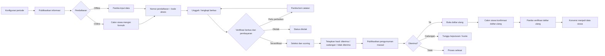
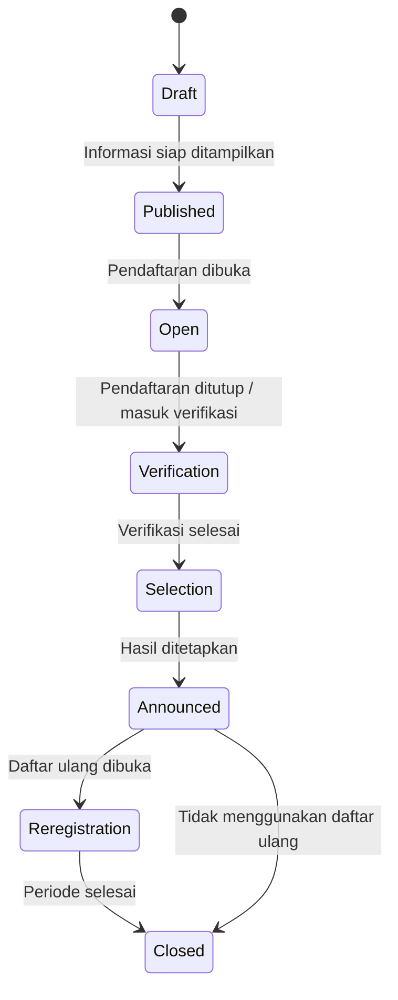
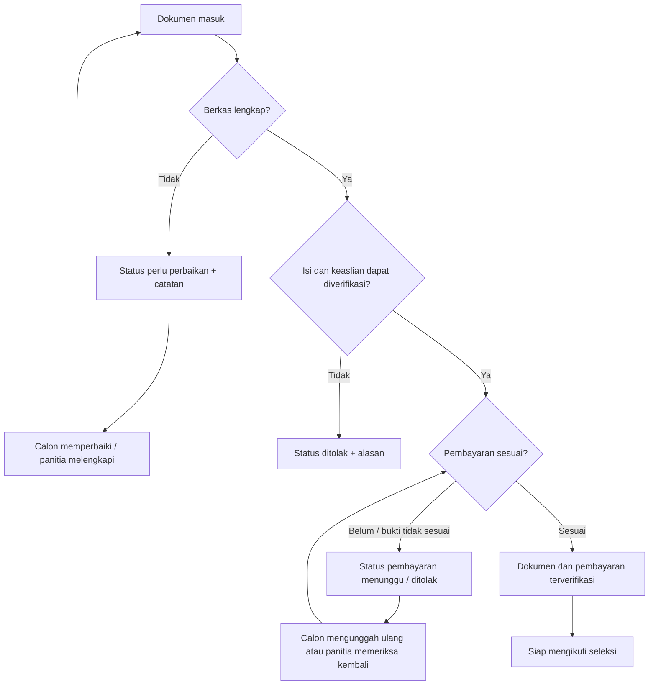

# SOP Panduan Alur PPDB

## 1. Identitas SOP

| Elemen | Ketentuan |
| --- | --- |
| Nama proses | Penerimaan Peserta Didik Baru (PPDB) |
| Mode layanan | Online dan offline |
| Jalur wajib | Umum, Prestasi, Pindahan |
| Jalur opsional | Zonasi dan Afirmasi |
| Pengguna utama | Calon peserta didik, orang tua/wali, panitia PPDB, pimpinan sekolah |
| Dokumen keluaran | Nomor pendaftaran, bukti pembayaran, hasil verifikasi, skor seleksi, pengumuman, bukti daftar ulang |

> Status periode, jalur, kuota, biaya, persyaratan, dan jadwal mengikuti pengaturan sekolah yang aktif.

## 2. Peta visual alur utama



## 3. Status periode PPDB



| Status | Makna operasional | Aktivitas utama |
| --- | --- | --- |
| Draft | Periode masih disiapkan | Atur jadwal, jalur, kuota, biaya, persyaratan |
| Published | Informasi dapat dibaca publik | Review informasi sebelum pendaftaran dibuka |
| Open | Pendaftaran aktif | Terima pendaftaran online dan input offline |
| Verification | Pemeriksaan administrasi | Periksa dokumen dan pembayaran |
| Selection | Penilaian calon | Isi scoring dan tetapkan hasil |
| Announced | Hasil telah diumumkan | Publikasi daftar hasil seleksi |
| Reregistration | Daftar ulang aktif | Konfirmasi dan verifikasi daftar ulang |
| Closed | Periode selesai | Arsip dan laporan akhir |

## 4. Pembagian peran

| Peran | Tanggung jawab |
| --- | --- |
| Super Admin | Pengaturan teknis sistem, pemulihan akses, dan pengawasan lintas sekolah |
| Admin Sekolah | Konfigurasi periode, jalur, kuota, biaya, persyaratan, dan pengawasan proses |
| Staf Tata Usaha / operator PPDB | Input offline, pemeriksaan berkas, pemeriksaan pembayaran, scoring, dan administrasi daftar ulang |
| Kepala Sekolah | Pengawasan, validasi keputusan, dan persetujuan pengumuman sesuai kebijakan sekolah |
| Calon siswa / orang tua | Mengisi data, mengunggah berkas, memantau status, dan melakukan daftar ulang |

> Catatan implementasi: tersedia role khusus `Panitia PPDB`. Gunakan akun pribadi panitia dan hindari penggunaan akun bersama. Hak konversi siswa dan pengaturan sensitif tetap mengikuti permission yang ditetapkan sekolah.

## 5. Tahap A — Konfigurasi periode

### Checklist admin

- [ ] Pastikan sekolah aktif dan level sekolah benar.
- [ ] Pilih tahun ajaran yang sesuai.
- [ ] Isi nama dan kode periode yang unik.
- [ ] Tentukan jadwal pendaftaran, verifikasi, pengumuman, dan daftar ulang.
- [ ] Aktifkan pembayaran bila diperlukan.
- [ ] Atur biaya pendaftaran.
- [ ] Pastikan jalur `Umum`, `Prestasi`, dan `Pindahan` tersedia.
- [ ] Aktifkan `Zonasi` atau `Afirmasi` hanya bila kebijakan sekolah memerlukannya.
- [ ] Atur kuota dan biaya setiap jalur.
- [ ] Atur persyaratan dokumen setiap jalur.
- [ ] Review periode bersama kepala sekolah sebelum dipublikasikan.

### Kontrol penting

- Kode periode tidak boleh sama dalam satu sekolah.
- Jadwal tidak boleh tumpang tindih secara tidak sengaja.
- Kuota `0` harus dipahami sebagai tidak dibatasi atau dikonfirmasi sesuai kebijakan aplikasi.
- Jangan membuka pendaftaran sebelum persyaratan, biaya, dan kontak panitia siap.

## 6. Tahap B — Pendaftaran online dan offline

### Jalur online

1. Calon siswa membuka halaman PPDB.
2. Calon siswa memilih periode dan jalur.
3. Calon siswa mengisi data calon siswa, orang tua/wali, alamat, dan kontak.
4. Calon siswa mengunggah dokumen sesuai persyaratan jalur.
5. Sistem membuat nomor pendaftaran dan kode akses.
6. Calon siswa menyimpan nomor pendaftaran dan kode akses secara aman.

### Jalur offline

1. Panitia menerima berkas fisik atau data dari calon siswa.
2. Panitia login menggunakan akun pribadi yang ditugaskan.
3. Panitia memilih periode dan jalur yang sesuai.
4. Panitia memasukkan data dengan membaca dokumen asli.
5. Panitia menyampaikan nomor pendaftaran dan kode akses kepada calon siswa/orang tua.
6. Panitia melengkapi berkas digital bila dokumen belum diunggah.

### Kontrol input

- Cocokkan nama, NIK/NISN, tanggal lahir, dan asal sekolah dengan dokumen sumber.
- Jangan memasukkan data calon siswa ke periode atau jalur yang berbeda.
- Jangan membagikan kode akses kepada pihak yang tidak berkepentingan.
- Jika ada kesalahan data, gunakan proses koreksi dan catat alasannya.

## 7. Tahap C — Verifikasi dokumen



### Checklist verifikator

- [ ] Nama pada dokumen sesuai dengan formulir.
- [ ] Dokumen dapat dibuka dan terbaca.
- [ ] Format dan ukuran file sesuai ketentuan.
- [ ] Dokumen tidak kedaluwarsa bila memiliki masa berlaku.
- [ ] Status setiap dokumen wajib sudah `Terverifikasi`.
- [ ] Bukti pembayaran tersedia bila pembayaran diwajibkan.
- [ ] Nominal dan identitas pembayaran sesuai.
- [ ] Catatan perbaikan atau penolakan ditulis jelas dan sopan.
- [ ] Status pendaftar baru diubah menjadi `Terverifikasi` setelah seluruh syarat terpenuhi.

### Prosedur pembayaran

1. Buka detail pendaftar.
2. Buka atau unduh bukti pembayaran melalui tombol `Unduh bukti pembayaran`.
3. Cocokkan nominal, tanggal, metode, dan identitas transaksi.
4. Jika benar, tekan `Verifikasi pembayaran`.
5. Jika belum benar, biarkan status menunggu atau minta perbaikan sesuai kondisi.
6. Catat alasan bila pembayaran ditolak melalui catatan verifikasi.

## 8. Tahap D — Seleksi dan scoring

### Prosedur

1. Pastikan pendaftar berstatus `Terverifikasi`.
2. Buka detail pendaftar pada menu daftar pendaftar.
3. Masukkan nilai berdasarkan kriteria yang telah disepakati, misalnya:
   - Nilai rapor.
   - Prestasi akademik/nonakademik.
   - Tes atau wawancara.
   - Kesesuaian jalur.
4. Isi catatan sumber atau alasan nilai.
5. Simpan setiap kriteria.
6. Periksa total dan rata-rata skor.
7. Lakukan rapat atau review panitia sesuai kebijakan sekolah.
8. Tetapkan status akhir:
   - `Diterima`.
   - `Cadangan`.
   - `Tidak diterima`.

> Skor adalah bahan pertimbangan. Status seleksi akhir harus ditetapkan oleh panitia sesuai kebijakan resmi sekolah dan dapat diaudit.

## 9. Tahap E — Pengumuman publik

1. Pastikan seluruh hasil seleksi sudah direview.
2. Pastikan status periode berada pada tahap pengumuman.
3. Isi waktu pengumuman yang telah disepakati.
4. Publikasikan periode.
5. Buka halaman pengumuman massal.
6. Periksa beberapa nomor pendaftaran secara acak.
7. Pastikan hanya hasil `Diterima`, `Cadangan`, dan `Tidak diterima` yang tampil.
8. Jangan menampilkan NIK, alamat, nomor telepon, skor detail, atau dokumen pribadi pada halaman publik.

Halaman publik:

`/ppdb/pengumuman/{id_periode}`

## 10. Tahap F — Daftar ulang dan konversi siswa

1. Buka daftar ulang untuk pendaftar berstatus `Diterima`.
2. Sampaikan batas waktu dan dokumen daftar ulang.
3. Calon siswa melakukan konfirmasi melalui nomor pendaftaran dan kode akses.
4. Panitia memeriksa konfirmasi dan dokumen daftar ulang.
5. Panitia menekan verifikasi daftar ulang.
6. Pastikan status berubah menjadi `Terverifikasi`.
7. Konversi pendaftar menjadi data siswa hanya setelah seluruh syarat selesai.
8. Periksa NIS, akun siswa, dan relasi orang tua setelah konversi.

## 11. Matriks keputusan singkat

| Kondisi | Tindakan panitia |
| --- | --- |
| Berkas belum lengkap | Minta perbaikan dengan catatan |
| Berkas tidak sah | Tolak dengan alasan |
| Pembayaran belum ada | Tunggu bukti atau konfirmasi pembayaran |
| Pembayaran sesuai | Verifikasi pembayaran |
| Semua syarat lengkap | Verifikasi pendaftar |
| Pendaftar terverifikasi | Masukkan ke proses scoring |
| Skor dan rapat selesai | Tetapkan hasil seleksi |
| Diterima | Buka daftar ulang |
| Daftar ulang terverifikasi | Konversi menjadi siswa |

## 12. Kontrol keamanan dan privasi

- Gunakan akun pribadi; jangan berbagi akun panitia.
- Berikan akses sesuai tugas dan gunakan role yang paling terbatas.
- Jangan mengirim kode akses melalui grup publik.
- Jangan mengunduh atau menyimpan dokumen calon siswa di perangkat umum tanpa perlindungan.
- Dokumen PPDB harus tetap privat dan diakses melalui tombol unduh yang memeriksa sekolah aktif.
- Jangan mengubah hasil seleksi tanpa catatan dan persetujuan internal.
- Periksa audit log ketika terjadi perubahan status yang dipersoalkan.
- Gunakan koneksi HTTPS pada lingkungan produksi.
- Hapus file hasil unduhan lokal setelah pekerjaan selesai bila perangkat dipakai bersama.

## 13. Checklist penutupan periode

- [ ] Semua pendaftar sudah memiliki status verifikasi.
- [ ] Semua skor dan catatan seleksi sudah disimpan.
- [ ] Hasil seleksi sudah disetujui pihak berwenang.
- [ ] Pengumuman publik sudah diperiksa.
- [ ] Daftar ulang pendaftar diterima sudah diverifikasi.
- [ ] Data siswa hasil konversi sudah diperiksa.
- [ ] Berkas dan laporan penting sudah diarsipkan sesuai kebijakan sekolah.
- [ ] Akses operator yang tidak lagi bertugas sudah ditinjau.
- [ ] Periode ditutup setelah seluruh proses selesai.

## 14. Ringkasan satu halaman

```text
KONFIGURASI
    ↓
PUBLISIKASI INFORMASI
    ↓
PENDAFTARAN ONLINE / OFFLINE
    ↓
VERIFIKASI DOKUMEN + PEMBAYARAN
    ↓
SCORING SELEKSI
    ↓
PENETAPAN HASIL
    ↓
PENGUMUMAN PUBLIK
    ↓
DAFTAR ULANG
    ↓
VERIFIKASI DAFTAR ULANG
    ↓
KONVERSI MENJADI SISWA
    ↓
PENUTUPAN DAN ARSIP
```
